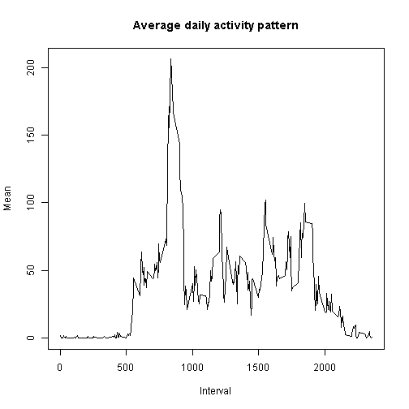

Reproducible Research: Peer Assessment 1
========================================================

This assignment makes use of data from a personal activity monitoring device. This device collects data at 5 minute intervals through out the day. The data consists of two months of data from an anonymous individual collected during the months of October and November, 2012 and include the number of steps taken in 5 minute intervals each day.

## Loading and preprocessing the data
First step is to load and process/transform the data into the proper datatypes. Below code chunk will load and format the data:


```r
# Set the working directory where activity data is stored
setwd("C:\\Data Science\\5. Reproducible Research\\Peer Assessment 1")

# Read the activity into a dataframe
activities <- read.csv("activity.csv")
activities[, 1] <- as.numeric(activities[, 1])
activities[, 2] <- as.Date(activities[, 2])
activities[, 3] <- as.numeric(activities[, 3])
```


## What is mean total number of steps taken per day?

```r
# get the total number of steps for each day
stepsByDate <- as.data.frame(tapply(activities$steps, activities$date, sum, 
    na.rm = TRUE))
names(stepsByDate) <- "steps"

# Draw histogram of number of steps for each day.
hist(stepsByDate$steps, main = "Total number of steps taken per day", xlab = "Total Steps Taken each Day", 
    ylab = "Frequency", col = "red")
```

 


Mean and Median total number of steps taken per day

```r
mean(stepsByDate$steps)
```

```
## [1] 9354
```

```r
median(stepsByDate$steps)
```

```
## [1] 10395
```


## What is the average daily activity pattern?
Preprocessing the data

```r
meanByInterval <- aggregate(steps ~ interval, data = activities, mean, na.rm = TRUE)
```


Time series plot of the average number of steps taken, averaged across all days (y-axis) vs
the 5-minute interval (x-axis)

```r
plot(steps ~ interval, data = meanByInterval, type = "l", main = "Average daily activity pattern", 
    xlab = "Interval", ylab = "Mean")
```

 


Which 5-minute interval, on average across all the days in the dataset,
contains the maximum number of steps?


```r
maxsteps = max(activity$steps, na.rm = TRUE)
```

```
## Error: object 'activity' not found
```

```r
# activity[which.max(activity$steps),]$interval
meanByInterval[which.max(meanByInterval$steps), ]$interval
```

```
## [1] 835
```


## Imputing missing values

Total number of missing values in the dataset

```r
sum(is.na(activities$steps))
```

```
## [1] 2304
```


Function for filling in all of the missing values in the dataset

```r
GetSimulatedData <- function(interval) {
    meanByInterval[meanByInterval$interval == interval, ]$steps
}
```


Create a new dataset with the missing data filled in.

```r
activitySimulated <- activities
for (i in 1:nrow(activitySimulated)) {
    if (is.na(activitySimulated[i, ]$steps)) {
        activitySimulated[i, ]$steps <- GetSimulatedData(activitySimulated[i, 
            ]$interval)
    }
}
```


Histogram of the total number of steps taken each day

```r
totalByDateSimulated <- aggregate(steps ~ date, data = activitySimulated, sum, 
    na.rm = TRUE)
hist(totalByDate$steps, col = "red", main = "Histogram of the total number of steps taken each day", 
    xlab = "Number of steps taken per day", ylab = "Frequency")
```

```
## Error: object 'totalByDate' not found
```


Mean total number of steps taken per day

```r
mean(totalByDateSimulated$steps)
```

```
## [1] 10766
```


Median total number of steps taken per day

```r
median(totalByDateSimulated$steps)
```

```
## [1] 10766
```


## Are there differences in activity patterns between weekdays and weekends?

Create a new factor variable in the dataset with two levels weekday and weekend indicating whether a given date is a weekday or weekend
day.

```r
activitySimulated$wday <- ifelse((as.POSIXlt(as.Date(activitySimulated$date))$wday - 
    1%%7) >= 5, "weekend", "weekday")
```


Panel plot containing a time series plot of the average number of steps taken, averaged
across all weekday days or weekend days (y-axis) vs 5-minute interval (x-axis)

```r
totalByWeekdaySimulated <- aggregate(steps ~ interval + wday, data = activitySimulated, 
    mean, na.rm = TRUE)
library(lattice)
xyplot(steps ~ interval | factor(wday), data = totalByWeekdaySimulated, ylab = "Number of steps", 
    type = "l", aspect = 1/2)
```

 

